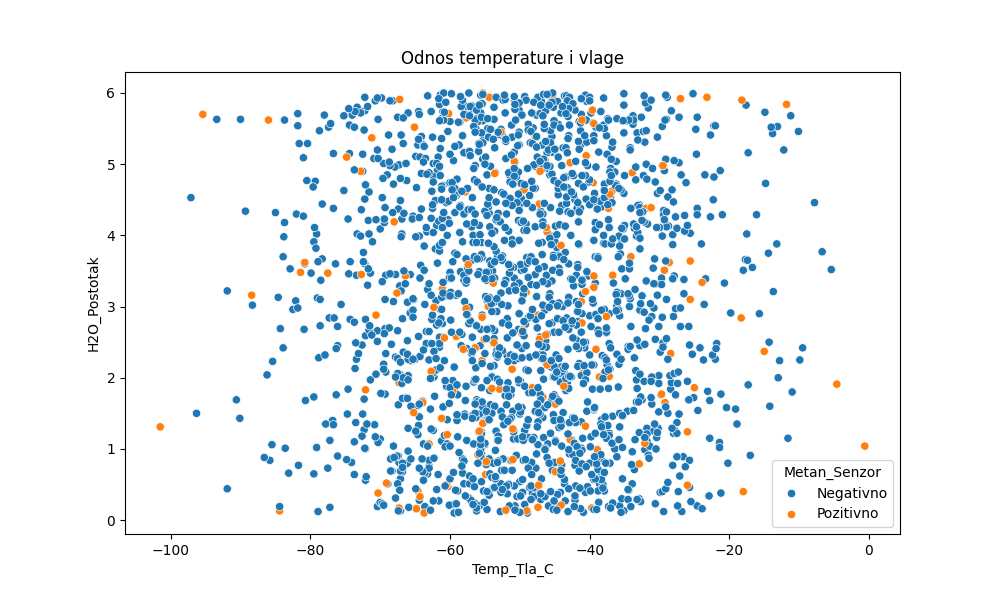
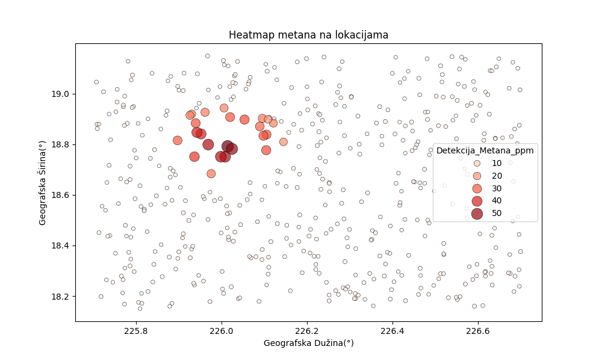

# Projekt Nexus: Analiza kratera Jezero

## A. Izvršni sažetak
Cilj ovog projekta je analiza telemetrije i uzoraka tla iz kratera Jezero na Marsu. Pomoću ulaznih CSV podataka mapiramo teren i atmosferske uvjete kako bismo na kraju izgenerirali automatizirani navigacijski nalog (JSON). To će omogućiti sigurno kretanje rovera kroz ključne točke (waypoints).

## B. Metodologija obrade podataka (Data Wrangling)
Sirovi podaci sa senzora imali su dosta šuma, pa sam ih u Pandas `DataFrameu` morao očistiti prije analize:
* **Temperature:** Obrisao sam sve zapise ispod -150°C i iznad 20°C jer očito ukazuju na grešku u kalibraciji termalnog senzora.
* **pH vrijednosti:** Filtrirano na raspon 5.0 - 9.0. Sve izvan toga je odbačeno kao anomalija kako ne bi uništilo završne izračune.

## C. Geoprostorna analiza i vizualizacija

### 1. Korelacija geoloških parametara

* Jasno se vidi snažna povezanost između detektirane razine vlage i specifičnih minerala na terenu.

### 2. Rasprostranjenost metana

* Toplinska karta pokazuje povećanu koncentraciju metana u sjeverozapadnom dijelu kratera, što taj sektor čini primarnom metom za daljnje istraživanje.

### 3. Satelitska mapa (Extent mapiranje)

* Podatke sa senzora pozicionirao sam na satelitsku snimku pomoću *extent* mapiranja (korištenjem bounding box granica: sjever, jug, istok, zapad). Ovo daje stvarni GPS kontekst koji je neophodan za orijentaciju rovera.

## D. Komunikacijski protokol (JSON Uplink)
Umjesto ručnog upisivanja , napisao sam petlju koja prolazi kroz očišćene podatke i automatski generira JSON navigacijski paket za rovera. Evo isječka tog paketa:

```json
{
  "mission_id": "NEXUS-01",
  "target_crater": "Jezero",
  "navigation_commands": [
    {
      "waypoint_id": 1,
      "latitude": 18.4447,
      "longitude": 77.4529,
      "action": "sample_collection"
    }
  ]
}
```

E. Inženjerski dnevnik (Troubleshooting Log)
Dva glavna problema s kojima sam se susreo tijekom koda:

Krivi separator (Greška kod spajanja tablica): Pandas nije htio učitati mars_uzorci.csv i izbacio je ParserError. Problem je bio što ta datoteka koristi točku sa zarezom (;) umjesto običnog zareza. Riješeno dodavanjem argumenta sep=';' u pd.read_csv().

JSON serijalizacija (Rušenje skripte): Skripta je pucala kod izrade JSON-a jer standardni modul ne prepoznaje NumPy int64 tipove podataka iz tablice. Riješio sam to prebacivanjem stupaca u obični Python broj preko .astype(int).

Autor-Sebastian Benvin
